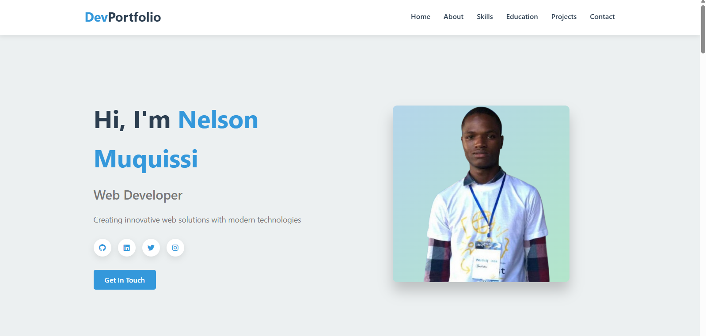

# 🌐 Nelson Muquissi - Web Developer Portfolio

 <!-- Add your actual screenshot path -->

> Modern, responsive portfolio showcasing my skills, projects, and professional journey

## 🚀 Live Demo
[](https://nelsonm.vercel.app/)  
<!-- Replace with your actual deployment URL -->

## ✨ Features
- **Fully Responsive** - Works on all devices
- **Interactive UI** - Smooth animations and transitions
- **6 Key Sections**:
  - Hero with call-to-action
  - About me with downloadable CV
  - Skills with progress bars
  - Education timeline
  - Project showcase
  - Functional contact form
- **Optimized Performance** - Fast loading times

## 🛠️ Tech Stack


## 📌 Key Projects

### 1. TalentStage
  
**Technologies**: HTML5, CSS3, JavaScript  
An innovative platform connecting talents with internship opportunities  
[Live Demo](https://nelsonmuquissi.github.io/TalentStage/) | [Source Code](https://github.com/NelsonMuquissi/TalentStage)

### 2. API Rest E-commerce
  
**Technologies**: Node.js, MySQL, Postman  
Robust API for product and order management  
[Live Demo](https://github.com/NelsonMuquissi/Api-Rest-Ecommerce) | [Source Code](https://github.com/NelsonMuquissi/Api-Rest-Ecommerce)

### 3. User API React Node
  
**Technologies**: React, Node.js, JavaScript  
System consuming API data with React frontend  
[Live Demo](https://github.com/NelsonMuquissi/User_API_React_Node) | [Source Code](https://github.com/NelsonMuquissi/User_API_React_Node)

## 📚 Education
| Period        | Institution                      | Qualification               |
|---------------|----------------------------------|-----------------------------|
| 2025-2028     | University of the People         | BSc Computer Science        |
| 2022-2025     | Instituto Politécnico do Zango   | High School Diploma         |
| 2025          | Power Learn Project              | Software Development Cert   |


## 🏆 PLP Hackathon Submission
This project was created for the **July 2025 Cohort Hackathon 1: Portfolio Challenge** at PLP Academy.

**Evaluation Criteria Met**:
- ✅ Creativity and Ingenuity (Custom animations and layout)
- ✅ Code Quality (Semantic HTML, clean CSS)
- ✅ Documentation (Detailed README)
- ✅ Deployment (Hosted on GitHub Pages)
- ✅ Technology Stack (Modern web technologies)

## 🛠️ Installation
```bash
git clone https://github.com/NelsonMuquissi/Portfolio.git
cd Portfolio
# Open index.html in browser

📬 Contact
Let's collaborate!
📧 emelsonmuquissi@gmail.com
📞 +244 936 327 119
🌍 Luanda, Angola

